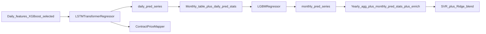

# 模型层技术文档（基于代码现状）

本文档描述仓库内 **已实现** 的多尺度预测模型、数据依赖、训练与推理差异、落盘产物，以及与申报书常见模型族表述的 **对齐与差距**。路径均相对于仓库根目录。

## 1. 文档范围与入口

| 角色 | 路径 |
|------|------|
| 核心实现 | [`src/models.py`](../src/models.py)（可学习预测器与双轨映射器） |
| 训练编排 | [`src/pipeline.py`](../src/pipeline.py) 中 `CoalResearchPipeline.train()` |
| 滚动回测 | [`src/backtest.py`](../src/backtest.py) 中 `rolling_backtest` |
| 特征工程 | [`src/features.py`](../src/features.py)（`build_feature_library`、`aggregate_monthly`、`aggregate_yearly`、`enrich_yearly_features`） |
| Web 推理 | [`app.py`](../app.py)（加载 `models/` 下产物并预测） |

## 2. 符号与记号（答辩常用）

| 记号 | 含义 |
|------|------|
| \(y\) | 目标变量：日/月/年尺度下均为 `market_price`（合同价用于映射器训练与评估） |
| `daily_pred` | 日度模型对 `market_price` 的预测序列 |
| `monthly_pred` | 月度 LightGBM 对月均价标的的预测 |
| `w` / `blend_weight_svr` | 年度混合预测中 SVR 权重，Ridge 权重为 \(1-w\) |
| MAPE / RMSE / MAE | 见 `evaluate_metrics`（[`src/models.py`](../src/models.py)） |

## 3. 多尺度依赖关系（与「日→月→年」叙事）

当前实现是 **层级特征传递**，而非单一端到端网络：

- **日度**：使用经 `select_core_features_xgboost` 筛选后的日频特征矩阵。
- **月度**：在 `aggregate_monthly` 结果上合并日度预测按月的 `mean` / `std` / `min` / `max`（见 `_build_monthly_enhanced` 与 `rolling_backtest` 中同类逻辑）。
- **年度**：在 `aggregate_yearly` 上合并月度预测按年的统计，并调用 `enrich_yearly_features`（见 `_build_yearly_enhanced`）。

**结论：**「先日再月再年」在工程上体现为 **下层预测进入上层特征表**；年度仍是 **年频样本上的 SVR+Ridge**，不是把日模型串成单一 RNN 端到端反传。

## 4. 各模型说明

### 4.1 日度：`LSTMTransformerRegressor`（PyTorch）

| 项 | 说明 |
|----|------|
| 结构 | 2 层 LSTM → 2 层 `TransformerEncoder` → MLP 回归头；取序列 **最后一步** 输出 |
| 输入形状 | `train_daily_model` 内将每行特征扩成 `(batch, 1, n_features)` 的伪序列 |
| 缩放 | `RobustScaler` 对 X、Y |
| 训练 | AdamW + HuberLoss；默认 `epochs=18`, `lr=8e-4`, `batch_size=64`（`DailyTrainerConfig`） |
| 评估 | Hold-out：时间序列上前 80% 训练、后 20% 测试（`_split_train_test`） |

**注意：** 实现为 **LSTM+Transformer 串联**。申报书若单独列出 GRU 或纯 Transformer-only 日度基线，本仓库 **未** 另建独立 GRU 模型文件。

### 4.2 月度：`LightGBM`（`LGBMRegressor`）

| 项 | 说明 |
|----|------|
| 基线 | `train_monthly_model` 固定超参 |
| 实际训练 | `train_best_monthly_model`：80/20 时序切分，3 组候选超参，验证集 MAPE 最小者，再 **全量 refit** |
| 特征 | 月度表列（含日度预测聚合列），去掉 `date` / `market_price` / `contract_price` |

申报书中的 **Prophet、XGBoost** 作为月度族：当前 **未** 在 [`src/models.py`](../src/models.py) 中实现为并列可切换训练路径。

### 4.3 年度：`SVR` + `Ridge` 混合（`YearlyBundle`）

| 项 | 说明 |
|----|------|
| 结构 | `RobustScaler` 作用于 SVR 输入；Ridge 用原始特征；预测为 `w * svr + (1-w) * ridge` |
| 调参 | `train_best_yearly_model`：多组 `C` / `epsilon` / `kernel` / `ridge_alpha`，多时间切分点验证，多 `blend_weight_svr`；选平均 CV MAPE 最优；最后 **全量训练** |
| 稳健性 | 对 `train_x` / `train_y` 做 inf/NaN 处理；`predict_yearly_bundle` 同样清洗 |
| 小样本 | `n < 3` 时回退到 `train_yearly_model` 固定超参 |

年度特征含 `enrich_yearly_features` 生成列，并含 **月度预测的年度聚合统计**，与「月→年」一致。

### 4.4 双轨合同价：`ContractPriceMapper`

| 项 | 说明 |
|----|------|
| 核心 | `LinearRegression` 将 **市场预测** 映射到 **合同价** |
| 规则约束 | 默认 `market * [0.85, 1.05]` 走廊；若提供 `policy_strength`，对上下界做平移（见 `ContractPriceMapper.predict`） |

## 5. 训练产物（`models/`）

| 文件 | 内容 |
|------|------|
| `daily_model.pt` | `LSTMTransformerRegressor` 的 `state_dict` |
| `daily_meta.joblib` | 选中特征列、`x_scaler`、`y_scaler` |
| `monthly_model.joblib` | 训练好的 `LGBMRegressor` |
| `monthly_meta.joblib` | 月度特征列名 |
| `yearly_bundle.joblib` | `YearlyBundle`（SVR+Ridge+scaler+blend 权重） |
| `yearly_meta.joblib` | 年度特征列名 |
| `contract_mapper.joblib` | `ContractPriceMapper` |
| `base_data.joblib` | 训练时底表 |

实验与指标：`reports/yearly_model_experiments.json`、`reports/online_holdout_metrics.json`、`reports/metadata.json`。

## 6. Web 推理与训练路径差异

- **日度**：与训练一致，使用 `daily_meta` 列与 `predict_daily_model`。
- **月度 / 年度**：`app.py` 对 `aggregate_monthly` / `aggregate_yearly` 结果按 `*_meta` **reindex**，缺列填 0。训练时年度还经过 `enrich_yearly_features`；线上若未完全复现 enrich，依赖 **列对齐 + 零填充**，可能与离线分布略有偏差。改进方向：在服务侧复用同一 `enrich_yearly_features` 或统一封装「最后一行年度特征」生成逻辑。

## 7. 与申报书模型族的差距（清单）

- **已实现并接入主链路：** 日度 LSTM+Transformer、月度 LightGBM、年度 SVR+Ridge、合同线性映射 + 规则走廊。
- **申报书常见列举但未作为主路径：** 独立 GRU、纯 Transformer-only 日度、月度 Prophet/XGBoost、年度多模型对照实验矩阵——需在 `models` 与 `pipeline` 中 **增加模型分支 + 统一指标输出** 方可称为族谱「全覆盖」。

## 8. 答辩引用建议

- 展示 **数据流图**（本文第 3 节 mermaid）说明层级特征传递。
- 展示 **`reports/online_holdout_metrics.json`** 与 **`reports/rolling_backtest_summary.json`** 作为样本外依据。
- 对年度指标目标（如 MAPE 阈值）需与 **年样本量**、**直接通道 vs 间接通道** 设计一并说明，避免单点承诺脱离数据支撑。
