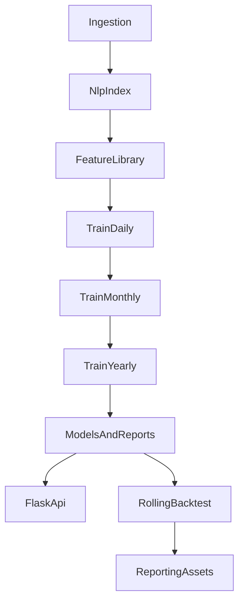

# 煤价预测系统技术总文档（Python + C++）

## 1. 系统目标与范围

本文档基于当前代码实现，完整梳理系统的技术实现过程，覆盖：

- 数据接入与治理
- 特征工程与多尺度建模
- 训练、回测、推理与报告产出
- 部署与运行约定
- 配置生效矩阵
- C++ 子工程与 Python 接线状态

说明：本文档以“代码现状”为准，区分已实现、部分实现和未接线能力。

## 2. 架构总览

### 2.1 代码入口与主链路

- 训练入口：`core/train.py` -> `core/src/pipeline.py::train_all`
- 服务入口：`core/app.py`（Flask）
- 主逻辑目录：`core/src`
- C++ 子工程：`core/cpp_core`

### 2.2 模块职责基线

- `core/src/ingestion.py`：多源数据接入与落盘（结构化/文本/天气）
- `core/src/nlp_index.py`：政策与舆情指数构建
- `core/src/features.py`：特征库、特征筛选、月/年聚合增强
- `core/src/models.py`：日/月/年模型与合同映射
- `core/src/backtest.py`：滚动回测与摘要
- `core/src/reporting.py`：实验表、图和可观测性报告
- `core/src/runtime_config.py`：模型与应用 YAML 配置读取
- `core/app.py`：模型加载、预测、仪表盘与运维接口

## 3. 端到端实现流程



### 3.1 训练流程

1. `core/src/pipeline.py::_build_research_dataset` 先复用 `data/curated/daily.csv`，否则触发 `MultiSourceIngestor.run()`。
2. 读取 `data/raw/*.csv` 后构建 NLP 指数并按 `date` 合并。
3. 通过 `build_feature_library` 构建日频特征，按时间切分后在训练段执行 `select_core_features_xgboost`。
4. 训练日度模型（LSTM+Transformer），再训练合同映射、月度 LightGBM、年度 SVR+Ridge。
5. 执行 `rolling_backtest`，写入回测折与汇总。
6. 落盘模型到 `models/`，报告到 `reports/`，并生成论文与可观测性产物。

### 3.2 推理流程

1. `core/app.py::ensure_state` 根据模型文件时间戳热加载模型。
2. `predict_next` 依次完成：
   - 日度预测 `predict_daily_model`
   - 日度稳定化 `stabilize_daily_predictions`
   - 合同价映射 `ContractPriceMapper.predict`
   - 月度聚合后月模型预测
   - 年度聚合增强后年模型预测
3. API 输出预测与仪表盘数据。

### 3.3 回测流程

- `core/src/backtest.py::rolling_backtest` 按测试年份滚动：
  - 训练集：`year < test_year`
  - 测试集：`year == test_year`
- 每折重训日/月/年模型并记录 `MAPE/RMSE/MAE`。
- 汇总阶段输出样本量加权均值，并附 `mape_std`、`mape_ci95`、`n_folds`。

### 3.4 报告流程

- `core/src/reporting.py::build_paper_assets` 统一生成：
  - `paper_experiment_tables.csv/.md`
  - `paper_figures_meta.json`（有 matplotlib 时输出图）
  - `observability_report.json`（重要性、漂移、回测不确定性）

### 3.5 部署流程

- 本地：`cd core && python train.py`，`cd core && gunicorn app:app ...`
- Docker：构建期训练后以 gunicorn 启动
- Render/Procfile：在 `core/` 下执行训练和服务命令

## 4. 模型与特征实现细节

### 4.1 日度模型

- 模型：`LSTMTransformerRegressor`
- 训练：`train_daily_model`（HuberLoss + AdamW + RobustScaler）
- 后处理：`stabilize_daily_predictions`（训练/回测/服务统一）

### 4.2 月度模型

- 模型：`LGBMRegressor`
- 入口：`train_best_monthly_model`
- 候选参数部分来自 `core/configs/model/monthly_lightgbm.yaml`

### 4.3 年度模型

- 模型：`SVR + Ridge` 融合 (`YearlyBundle`)
- 入口：`train_best_yearly_model`
- 默认参数基于 `core/configs/model/yearly_svr.yaml`

### 4.4 特征机制

- 日频特征：lag/rolling/ewm/wavelet/交叉项
- 特征筛选：XGBoost 特征重要性（失败时回退 RF）
- 产物：`reports/feature_importance_full.csv`、`reports/feature_drift_summary.csv`

## 5. 配置生效矩阵

| 配置/变量 | 是否生效 | 生效位置 | 影响范围 |
|---|---|---|---|
| `core/configs/model/daily_lstm_transformer.yaml` | 是 | `core/src/runtime_config.py` -> `core/src/pipeline.py` | 日度训练 epochs/lr/batch_size |
| `core/configs/model/monthly_lightgbm.yaml` | 是（部分） | `core/src/runtime_config.py` -> `core/src/models.py` | 月度候选参数默认组 |
| `core/configs/model/yearly_svr.yaml` | 是（默认层） | `core/src/runtime_config.py` -> `core/src/models.py` | 年度基础默认参数 |
| `core/configs/app/*.yaml` | 部分 | `core/src/runtime_config.py` -> `core/app.py` 的 `__main__` | 仅 `python app.py` 启动时 host/port |
| `core/configs/data/*.yaml` | 否（主链路未读） | - | 当前为未接线配置 |
| `core/configs/cpp/*.yaml` | 否（主链路未读） | - | 当前为未接线配置 |
| `FAST_MODE` | 是 | `core/train.py`、`core/python/cli/run_train.py` | 训练快慢、回测范围、NLP策略 |
| `REFRESH_CACHE` | 是 | `core/train.py`、`core/src/pipeline.py` | 是否复用缓存 |
| `LIVE_TEXT_SOURCES` | 是 | `core/src/pipeline.py` | 是否启用在线文本源 |
| `APP_ENV` | 部分 | `core/app.py` | 仅 `app.run` 路径生效 |

## 6. API 与运行产物

### 6.1 核心 API

- `/api/predict`：预测接口，`csv_path` 仅允许 `core/data/predict_inputs` 与 `core/data/curated` 白名单目录
- `/api/dashboard`、`/api/dashboard_full`：仪表盘数据
- `/api/backtest`、`/api/metadata`、`/api/observability`：回测、元数据、可观测性
- `/health`：健康检查

### 6.2 关键产物目录

- `core/models/`：模型与元数据
- `core/reports/`：评估、回测、论文资产、可观测性
- `core/data/`：raw/curated/runtime 等数据层

## 7. C++ 子工程现状

### 7.1 已实现部分

- `core/cpp_core/CMakeLists.txt` 当前定义静态库 `core`
- `include/` + `src/` 包含 feature/signal/risk/io 四类基础函数

### 7.2 未接线部分

- `core/cpp_core/bindings/pybind_module.cpp` 仅占位注释，无 `PYBIND11_MODULE`
- CMake 未定义 pybind 模块目标
- Python 主链路中无对 C++ 扩展的 import/调用

结论：C++ 子工程当前属于“存在实现但未接入 Python 生产链路”状态。

## 8. 部署与运行约定（当前口径）

- 统一建议在 `core/` 作为工作目录运行。
- `Procfile` 与 `render.yaml` 走 `$PORT`，适配平台注入端口。
- Docker 默认暴露 `7860`，并在镜像构建阶段执行训练。
- 训练与服务建议统一 timeout、环境变量策略，避免不同部署介质行为不一致。

## 9. 已知风险与改进优先级

### P0

- 时序特征与 NLP 截断拟合仍需持续做泄漏审计
- 不同部署路径的配置生效面存在差异（尤其 `app/*.yaml`）

### P1

- `core/configs/data/*.yaml` 与 `core/configs/cpp/*.yaml` 尚未接入主链路
- `run_backtest.py` 实际调用 `train_all`，语义上不是“仅回测”

### P2

- C++ 模块需补充 pybind 与 Python bridge
- 可继续扩展模型可解释性（例如 SHAP）与线上漂移告警机制

## 10. 复现实操命令

```bash
# 安装
python3 -m venv .venv
source .venv/bin/activate
pip install -r core/requirements.txt

# 训练
cd core
python train.py

# 服务
gunicorn app:app --bind 0.0.0.0:7860 --timeout 120
```

